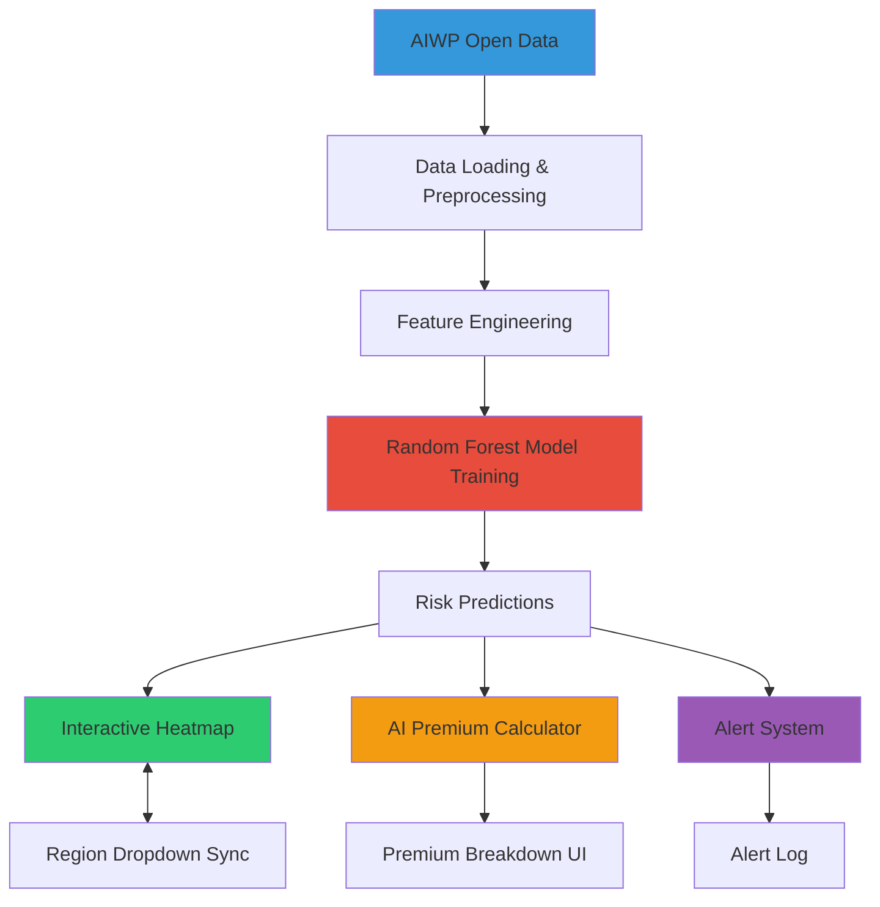

# 🌍 ClimaShield 2.0

**AI for Predictive Protection & Dignified Adaptation**

ClimaShield 2.0 is an AI-powered climate displacement risk prediction and adaptive micro-insurance platform built for a 24-hour hackathon. It leverages **AI for Water and Planet (AIWP)** open data to predict regional climate risks, calculate personalized insurance premiums, and deliver early warnings to vulnerable communities.

---

## 🎯 Features

### 1️⃣ **AI Risk Heatmap**
- Interactive map visualization using Folium
- Real-time risk predictions from Random Forest ML model
- Color-coded regions by risk level (Low → Critical)
- Synchronized map ↔ dropdown region selection
- Detailed tooltips with risk scores and summaries

### 2️⃣ **AI-Powered Premium Calculator**
- Dynamic premium calculation based on:
  - Regional climate risk (ML-predicted)
  - User income level (with subsidy support)
- AI-adjusted pricing formula: `premium = base_rate × sigmoid(risk + income_factor)`
- Transparent breakdown of premium components
- Estimated disaster payout calculations

### 3️⃣ **Smart Alert System**
- Automatic risk threshold monitoring
- Real-time alerts for high-risk regions
- Alert log with timestamp history
- Simulated SMS notification system
- Actionable recommendations

### 4️⃣ **AI Explainability**
- Feature importance visualization
- Understanding model predictions
- Top climate risk factors display
- Educational explanations

### 5️⃣ **Statistics Dashboard**
- Global risk metrics
- Risk distribution histograms
- Real-time monitoring of regions

---

## 🏗️ Architecture



---

## 📂 Project Structure

```
ClimaShield v2/
├── main.py              # Streamlit application entry point
├── ui.py                # UI components and layout logic
├── data_model.py        # Data loading, ML model, predictions
├── utils.py             # Helper functions (sigmoid, alerts, etc.)
├── requirements.txt     # Python dependencies
└── README.md            # This file
```

### File Descriptions

- **`main.py`**: Main Streamlit application that orchestrates all components
- **`ui.py`**: All UI rendering functions (map, calculator, alerts, charts)
- **`data_model.py`**: Data pipeline, ML model training, and prediction logic
- **`utils.py`**: Utility functions for calculations, formatting, and explainability

---

## 🚀 Quick Start

### Prerequisites

- **Python 3.10+**
- **pip** (Python package manager)
- (Optional) AWS credentials for real AIWP data access

### Installation

1. **Clone or download the project**
   ```bash
   cd "c:\ClimaShield" //wherever your project directory is
   ```

2. **Create a virtual environment (recommended)**
   ```powershell
   python -m venv venv
   .\venv\Scripts\Activate.ps1
   ```

3. **Install dependencies**
   ```powershell
   pip install -r requirements.txt
   ```

### Running the Application

```powershell
streamlit run main.py
```

The app will open in your browser at `http://localhost:8501`

---

## 🔧 Configuration

### Using Real AIWP Data

To use actual AIWP climate data from AWS S3:

1. Install AWS CLI and configure credentials:
   ```powershell
   pip install awscli
   aws configure
   ```

2. In `data_model.py`, change:
   ```python
   df_raw = load_aiwp_data(use_sample=True)  # Change to False
   ```

### Customizing Risk Thresholds

Edit thresholds in `utils.py`:

```python
def get_risk_category(risk_score: float) -> tuple:
    if risk_score < 0.3:      # Low risk threshold
        return ("Low Risk", "#2ecc71")
    elif risk_score < 0.5:    # Moderate risk threshold
        # ... etc
```

### Adjusting Premium Calculation

Modify parameters in `utils.py`:

```python
def calculate_ai_premium(
    risk_score: float,
    income: float,
    base_rate: float = 50.0,      # Change base rate
    risk_weight: float = 1.0,      # Adjust risk influence
    income_weight: float = 0.5     # Adjust income subsidy
):
```

---

## 🧠 How It Works

### 1. Data Pipeline

1. Load AIWP climate data (precipitation, temperature, soil moisture, etc.)
2. Engineer features (anomalies, composite indicators)
3. Create synthetic risk targets based on climate factors

### 2. ML Model Training

- **Algorithm**: Random Forest Regressor
- **Features**: 11 climate and geographic indicators
- **Target**: Climate displacement risk score (0-1)
- **Validation**: Train/test split with R² scoring

### 3. Risk Prediction

```python
risk_score = model.predict(scaled_features)
# Outputs: 0 (low risk) → 1 (critical risk)
```

### 4. Premium Calculation

```python
premium = base_rate × sigmoid(
    risk_weight × risk_score + 
    income_weight × (1 - income_index)
)
```

- **Higher risk** → Higher premium
- **Lower income** → Higher subsidy (lower premium)

---

## 📊 Sample Data

The app includes synthetic sample data for 10 regions:

- 🇧🇩 Bangladesh (Dhaka)
- 🇮🇳 India (Mumbai)
- 🇵🇭 Philippines (Manila)
- 🇵🇰 Pakistan (Karachi)
- 🇮🇩 Indonesia (Jakarta)
- 🇻🇳 Vietnam (Ho Chi Minh)
- 🇰🇪 Kenya (Nairobi)
- 🇳🇬 Nigeria (Lagos)
- 🇧🇷 Brazil (São Paulo)
- 🇲🇽 Mexico (Mexico City)

Each region has realistic climate features and coordinates for demonstration.

---

## 🎓 Key Technologies

| Technology | Purpose |
|------------|---------|
| **Streamlit** | Web application framework |
| **scikit-learn** | Machine learning (Random Forest) |
| **Pandas/NumPy** | Data processing and analysis |
| **Folium** | Interactive map visualization |
| **Plotly** | Charts and graphs |
| **SHAP** | AI explainability (optional) |
| **boto3** | AWS S3 data access (optional) |

---

## 🌟 Stretch Features

### Implemented
- ✅ AI risk heatmap with real predictions
- ✅ AI-powered premium calculator
- ✅ Smart alert system with log
- ✅ Map ↔ dropdown synchronization
- ✅ Feature importance visualization
- ✅ Statistics dashboard

### Future Enhancements
- 🔄 SHAP explainability for individual predictions
- 🔄 Admin mode for policy adjustments
- 🔄 Twilio integration for real SMS alerts
- 🔄 Historical trend analysis
- 🔄 Multi-language support
- 🔄 Mobile-responsive design

---

## 🐛 Troubleshooting

### Map not displaying
- Ensure `streamlit-folium` is installed: `pip install streamlit-folium`
- Check internet connection (Folium requires map tiles)

### Model training errors
- Verify all dependencies are installed
- Check Python version (3.10+ required)
- Try: `pip install --upgrade scikit-learn pandas numpy`

### AWS S3 access issues
- Set `use_sample=True` in `data_model.py` to use synthetic data
- Configure AWS credentials if using real AIWP data

### Streamlit crashes
- Clear cache: `streamlit cache clear`
- Restart the application

---

## 📖 Usage Guide

### Step 1: Select a Region
- Use the dropdown or click a marker on the map
- Region highlights automatically

### Step 2: Check Risk Level
- View risk score and category
- Read the risk summary

### Step 3: Calculate Premium
- Enter your monthly income
- Click "Calculate Premium"
- View personalized quote and breakdown

### Step 4: Monitor Alerts
- High-risk regions show automatic alerts
- Check alert log for history
- Simulate SMS notifications

### Step 5: Explore AI Insights
- View feature importance
- Understand risk factors
- Review statistics dashboard

---

## 🏆 Hackathon Readiness

This project is optimized for 24-hour hackathon demos:

- ✅ **Modular code** - Easy to understand and modify
- ✅ **Comprehensive docstrings** - Self-documenting
- ✅ **Sample data included** - Works without external APIs
- ✅ **Fast setup** - < 5 minutes to run
- ✅ **Visual appeal** - Professional UI with custom CSS
- ✅ **Clear architecture** - Mermaid diagram included
- ✅ **Educational** - Includes AI explainability

---

## 📝 License

MIT License - Free for hackathons and educational purposes.

---

## 👥 Contributing

Contributions welcome! Areas for improvement:

- Enhanced AIWP data integration
- Advanced ML models (XGBoost, Neural Networks)
- Real-time weather API integration
- Mobile app version
- Blockchain-based insurance contracts

---

## 📞 Support

For questions or issues:
- Check the troubleshooting section
- Review inline code comments
- Inspect Streamlit error messages

---

## 🙏 Acknowledgments

- **AIWP** - AI for Water and Planet open data initiative
- **Streamlit** - Rapid web app development
- **scikit-learn** - Machine learning tools
- **OpenStreetMap** - Map data

---

<div align="center">

**Built with ❤️ for Climate Resilience**

🌍 ClimaShield 2.0 | November 2025 | 24-Hour Hackathon MVP

</div>
